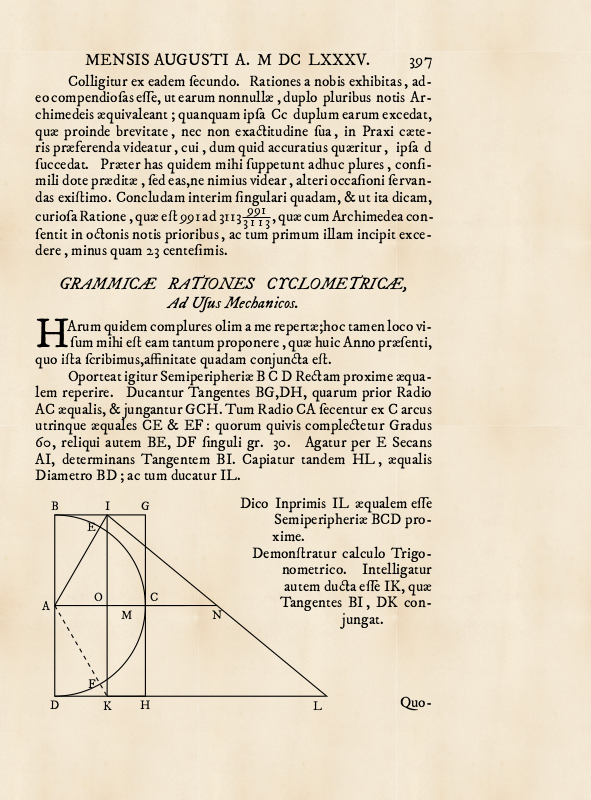

# Kochański's Approximation
LaTeX facsimile of the Kochański's approximation published in Acta Eruditorum in 1685
## About the Project
The project is a proof of concept for creating digital replicas of old
scientific texts. Here, as an example, a page from _Acta Eruditorum_ was used,
presenting Adam Adamandy Kochański's approximation.

## Requirements
To compile the code the following requirements must be met
* TeX distribution with XeLaTeX installed (see e.g. [TeXLive](https://www.tug.org/texlive/))
* [Fell Types](http://iginomarini.com/fell/the-revival-fonts/) fonts installed (at least IM FELL DW Pica PRO)

## Output

## Original typesetting – various digitizations
There are two versions:
* Version A, where the last line of the first paragraph is "dere, minus quam 23 centesimis." 
* Version B, where the last line of the first paragraph is "23 centesimis."

### Version A

Additionally Acta Eruditorum 1685 is available as [DJVU digitization](http://obc.opole.pl/dlibra/doccontent?id=6778) prepared by Opole Digital Library.

### Version B

## Further reading

* [A. A. Kochański, _Observationes cyclometricae ad facilitandam praxin accomodatae_, Acta Eruditorum 4 (1685) 394–398.](https://books.google.pl/books?id=2dlkRbUfzKsC&hl=pl&pg=PA397#v=onepage&q&f=false)
* [H. Fukś. _Observationes cyclometricae by Adam Adamandy Kochański – Latin text with annotated English translation_, 2011.](https://arxiv.org/abs/1106.1808.pdf)
* [H. Fukś. _Adam Adamandy Kochański’s approximations of π: Reconstruction of the algorithm._ The Mathematical Intelligencer, 34(4): 40–45, 2012.](https://doi.org/10.1007/s00283-012-9312-1)
* [Wikipedia contributors. _Acta Eruditorum_ [Internet]. Wikipedia, The Free
  Encyclopedia.](https://en.wikipedia.org/wiki/Acta_Eruditorum)
* [Wikipedia contributors. _Adam Adamandy Kochański_ [Internet]. Wikipedia, The
  Free Encyclopedia.](https://en.wikipedia.org/wiki/Adam_Adamandy_Kocha%C5%84ski)
* [A. Żaba, _Commentary on history of Adam Kochański’s circle rectification popularization._ Journal Biuletyn of Polish Society for Geometry and Engineering Graphics 23 (2012).](http://ogigi.polsl.pl/biuletyny/Zeszyt_23/Biuletyn-23_89_94.pdf)
* [Z. Pawlikowska, _Adam Adamandy Kochański i jego prace matematyczne_, 11, 1 (1969), 19–48](https://doi.org/10.14708/wm.v11i1.2100)
